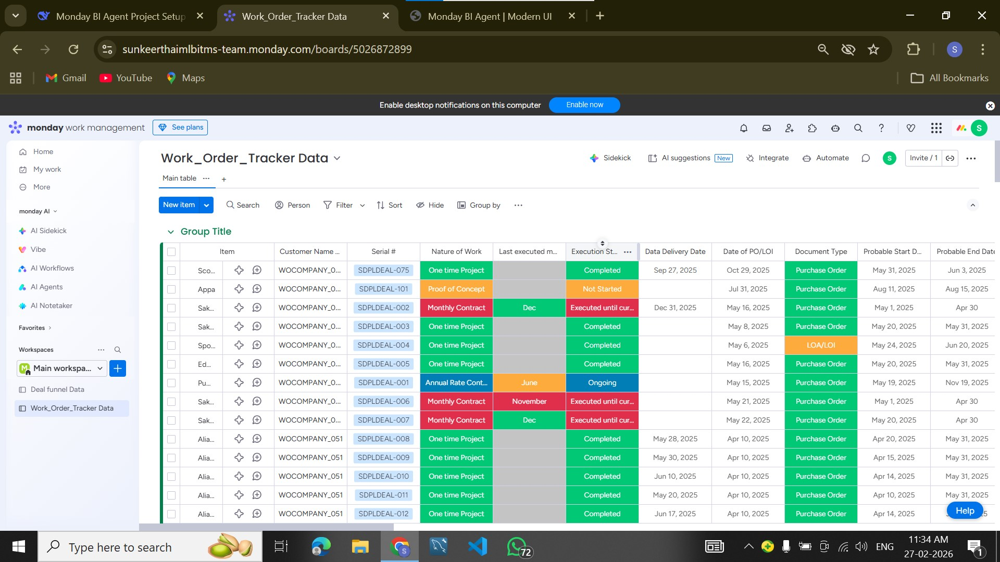
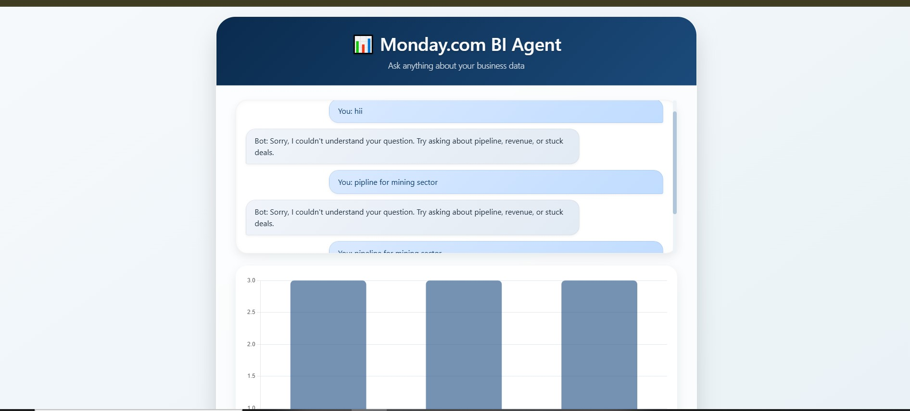
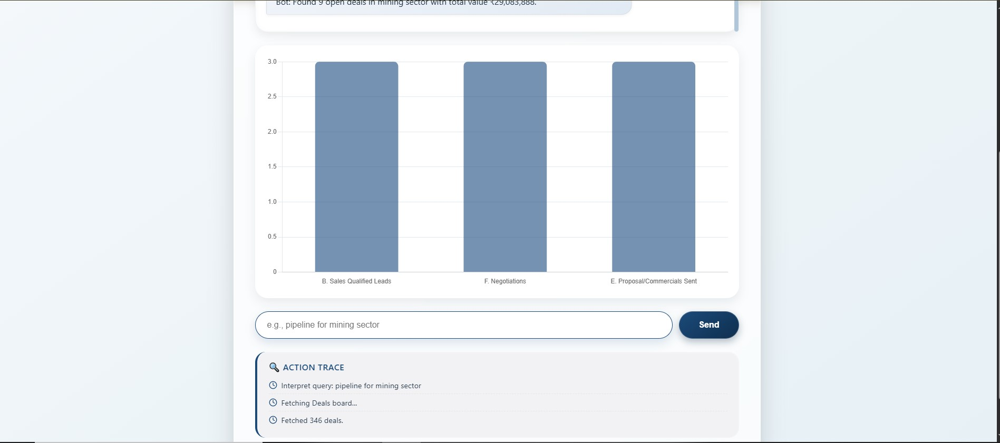

# Monday.com Business Intelligence Agent 🤖📊

[](https://frontendsuu.netlify.app)  
[](https://monday-com-business-intelligence-agent.onrender.com)  
[](https://python.org)  
[](https://fastapi.tiangolo.com)

An AI-powered conversational Business Intelligence agent that answers founder-level queries using **live Monday.com data** from Deals and Work Orders boards.  
It fetches real-time data, cleans messy values, provides insights, displays action traces, and includes **voice output + charts**.

---

# 📌 Problem Statement

Business teams and founders need quick insights from CRM and operations data.

However, extracting answers manually requires:
- Pulling data from multiple dashboards
- Cleaning inconsistent formats
- Doing calculations manually
- Creating reports and charts

This project automates the entire process using an intelligent conversational BI agent.

The agent:
- Understands natural language queries
- Fetches live Monday.com data (no caching)
- Cleans messy data automatically
- Computes revenue & pipeline insights
- Shows transparent action trace
- Speaks answers using voice output

---

# ✨ Features

## 🔴 Core Features
- Live Monday.com API integration (GraphQL)
- Real-time data fetching
- Handles missing values & messy formats
- Currency normalization & date parsing
- Action trace of every step

## 🧠 Intelligence
- Natural language query understanding
- Revenue and pipeline analysis
- Sector-wise performance
- Stuck deals detection
- Work order insights

## 🔊 Interactive Features
- Voice output (Web Speech API)
- Modern chat UI
- Chart visualizations (Chart.js)
- Responsive interface

---

# 🎥 Demo Video

<video src="video/MONDAY.COM.mp4" controls width="100%" style="max-width:800px;"></video>

If video preview doesn't play on GitHub, download and watch locally.

---

# 🔗 Live Links

| Component | URL |
|-----------|-----|
| **Frontend (Netlify)** | https://frontendsuu.netlify.app |
| **Backend API (Render)** | https://monday-com-business-intelligence-agent.onrender.com |
| **GitHub Repo** | https://github.com/Sunkeerth/Monday.com-Business-Intelligence-Agent |
| **Deals Board** | *(Add your share link)* |
| **Work Orders Board** | *(Add your share link)* |

---

# 🛠 Technology Stack

## Backend
- Python 3.9+
- FastAPI
- Uvicorn
- Pandas
- Requests
- Python-dotenv

## Frontend
- HTML5
- CSS3
- JavaScript
- Chart.js
- Web Speech API

## Deployment
- Render (Backend)
- Netlify (Frontend)
- GitHub (Version Control)

---

# 📁 Project Structure

```
Monday.com-Business-Intelligence-Agent/
│
├── backend/
│   ├── main.py
│   ├── monday_client.py
│   ├── query_processor.py
│   ├── data_cleaner.py
│   ├── requirements.txt
│   └── .env.example
│
├── frontend/
│   ├── index.html
│   ├── style.css
│   └── script.js
│
├── images/
│   ├── image00.jpg
│   ├── image01.jpg
│   └── image02.jpg
│
├── video/
│   └── MONDAY.COM.mp4
│
├── decision_log.pdf
└── README.md
```

---

# 📸 Screenshots

| Chat Interface | Trace Panel | Chart Example |
|----------------|-------------|---------------|
|  |  |  |

---

# ⚙️ Local Setup Guide

## 1. Clone Repository
```bash
git clone https://github.com/Sunkeerth/Monday.com-Business-Intelligence-Agent.git
cd Monday.com-Business-Intelligence-Agent
```

## 2. Backend Setup
```bash
cd backend
python -m venv venv
```

### Activate venv

Windows:
```bash
venv\Scripts\activate
```

Linux/Mac:
```bash
source venv/bin/activate
```

### Install dependencies
```bash
pip install -r requirements.txt
```

---

## 3. Create .env file (inside backend)
```
MONDAY_API_KEY=your_api_key
DEALS_BOARD_ID=your_board_id
WORK_ORDERS_BOARD_ID=your_board_id
```

---

## 4. Run Backend
```bash
uvicorn main:app --reload
```

API runs at:
```
http://127.0.0.1:8000
```

---

## 5. Run Frontend
```bash
cd frontend
python -m http.server 5500
```

Open:
```
http://localhost:5500
```

---

# 🌍 Deployment

## Backend → Render
- Root directory: backend  
- Build: `pip install -r requirements.txt`  
- Start: `uvicorn main:app --host 0.0.0.0 --port $PORT`  
- Add environment variables in dashboard  

## Frontend → Netlify
- Publish directory: frontend  
- Update backend API URL in script.js  
- Deploy  

---

# 🧠 Technical Decisions

### FastAPI
- Async & fast
- Easy deployment
- Clean architecture

### Pandas
- Handles messy data
- Date parsing
- Currency normalization
- Missing values

### Query Processing
- Rule-based NLP
- Keyword extraction
- Extensible to LLM

### No Caching
Every query → live Monday API call  
Ensures real-time accuracy

---

# 📊 Example Queries

Try asking:
- Total revenue this month  
- Pipeline for mining sector  
- Deals closing this week  
- Stuck deals  
- Revenue by sector  
- Work order summary  

---

# 📄 Decision Log

See: **decision_log.pdf**

Contains:
- Architecture decisions  
- Trade-offs  
- Assumptions  
- Improvements  

---

# 🔐 Security Note

Do NOT commit `.env` file.  
Keep API keys private.

---

# 👨‍💻 Author

**Sunkeerth**  
AI & Robotics Engineer  

GitHub: https://github.com/Sunkeerth  
LinkedIn: https://linkedin.com/in/sunkeerth-ab14b3337  

Focused on:
- Robotics AI  
- Multimodal AI  
- Autonomous systems  
- Simulation  

---

# ⭐ Acknowledgments

- Monday.com API  
- FastAPI  
- Chart.js  
- Open-source community  

---

# 🚀 Status

✔ Live deployed  
✔ GitHub ready  
✔ Screenshots added  
✔ Demo added  
✔ Assignment ready  
